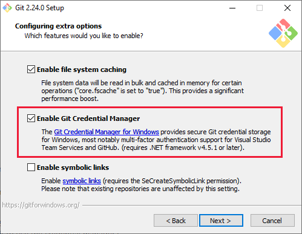

<!-- omit in toc -->
# Git Handbook

Please also refer to the [Additional Information](#additional-information) section.

**Table of Contents**

- [Most Common Commands and Concepts](#most-common-commands-and-concepts)
  - [Add](#add)
  - [Amend](#amend)
  - [Branch](#branch)
  - [Bundle](#bundle)
  - [Cherry-Pick](#cherry-pick)
  - [Checkout](#checkout)
  - [Clone](#clone)
  - [Commit](#commit)
  - [Config](#config)
  - [Fetch](#fetch)
  - [Fixup](#fixup)
  - [Fork](#fork)
  - [Index](#index)
  - [Init](#init)
  - [Log](#log)
  - [Merge](#merge)
  - [Merge-Base](#merge-base)
  - [Pull Request](#pull-request)
  - [Pull](#pull)
  - [Push](#push)
  - [Rebase](#rebase)
  - [Rebase - Interactive](#rebase---interactive)
  - [Rebase `--onto`](#rebase---onto)
  - [Remote](#remote)
  - [Reset](#reset)
  - [Restore](#restore)
  - [Revert](#revert)
  - [Stash](#stash)
  - [Status](#status)
  - [Submodules](#submodules)
    - [Attaching New Submodule To Existing Repository](#attaching-new-submodule-to-existing-repository)
    - [Cloning Repository With Submodules](#cloning-repository-with-submodules)
    - [Cloning Repository With Submodules (Alternative)](#cloning-repository-with-submodules-alternative)
- [Useful Workflows](#useful-workflows)
  - [Amend and Push-Force](#amend-and-push-force)
  - [Backup a Branch (Bundle)](#backup-a-branch-bundle)
  - [Backup a Branch (Create a Copy Pointer)](#backup-a-branch-create-a-copy-pointer)
  - [Cancel a Rebase or Merge](#cancel-a-rebase-or-merge)
  - [Fixup](#fixup-1)
  - [Rebase and Squash](#rebase-and-squash)
  - [Reset Hard](#reset-hard)
- [Additional Information](#additional-information)
  - [Suggested Resources](#suggested-resources)
  - [First Configuration](#first-configuration)
  - [Creating a New Repository](#creating-a-new-repository)
  - [Excluding From Versioning (`.gitignore`)](#excluding-from-versioning-gitignore)
  - [Credential Management](#credential-management)
    - [Microsoft Windows](#microsoft-windows)
    - [Linux / Ubuntu](#linux--ubuntu)
    - [GitHub CLI](#github-cli)
    - [Creating and Using an SSH Key](#creating-and-using-an-ssh-key)
  - [Self-Signed Certificate (TLS/SSL Verification)](#self-signed-certificate-tlsssl-verification)
  - [Windows Subsystem For Linux](#windows-subsystem-for-linux)
  - [Visual Studio Code](#visual-studio-code)
    - [Links](#links)


# Most Common Commands and Concepts

## Add

Allows to move any modified files from the *working area* to the *staging area*. The *staging area* is a sort of launch pad to review the changes before committing them. The commit is executed by `git commit`.

To remove files from the *staging area*, use [`git restore`](#restore).

<!-- omit in toc -->
### Resources / Deep Dive

<!-- omit in toc -->
### Syntax

Moves all changes made to the *working area* (new files, modified files, removed files) to the *staging area*:
```git
git add -A
```

Moves only new files and modified files to the *staging area*, not removed files:
```git
git add .
```

Moves only modified files and removed files to the *staging area*, not new ones:
```git
git add -u
```

Moves only a specific file to the *staging area*:
```git
git add <filename>
```

## Amend

The `git commit --amend` command is a convenient way to modify the most recent commit. It lets you combine staged changes with the previous commit instead of creating an entirely new commit. It can also be used to simply edit the previous commit message without changing its snapshot.

The `git commit --amend` command modifies the last commit in time order. By launching it from the command line:

- An editor is opened (similar to Vim by default, but it is possible to reassign it, specifying for example [Visual Studio Code](#visual-studio-code)) that allows, optionally, to modify the commit message.
- Each change currently in the staging area will be used to correct the commit.

There are two commonly used variants; both allow you to avoid opening the editor:

- `git commit --amend -m "New message"`: the new commit message is passed as a parameter, after `-m`.
- `git commit --amend --no-edit`: specifies that you do not want to change the commit message, so only the code changes will be used for the amend.

**Note**: if you are working on Windows Terminal or PowerShell, and the terminal does not support multi-line command copy-paste (as can happen when you want to change a message with `git amend`), follow these instructions (taken from [Stack Overflow](https://stackoverflow.com/a/67432615/7598767)):
- Open Windows Terminal
- Open settings
- Click on *Open JSON File* in the lower left corner
- Disable (comment out) the command `{ "command": "paste", "keys": "ctrl+v" }`
- Warning: other shells (different from PowerShell) may no longer support CTRL + V to paste. In this case, use CTRL + SHIFT + V.

**Note**: `git amend` acts only on the *last* commit in time order. If you want to change a previous commit, i.e. from the penultimate onwards, you need to use [fixup](#fixup) or [interactive rebase](#rebase---interactive).


<!-- omit in toc -->
### Resources / Deep Dive

- [Atlassian](https://www.atlassian.com/git/tutorials/rewriting-history#git-commit--amend)

<!-- omit in toc -->
### Syntax

- With interactive console to edit the commit message:
  ```git
  git commit --amend
  ```
- Without opening the console because the new message is already passed:
  ```git
  git commit --amend -m "an updated commit message"
  ```
- Without opening the console because you do not intend to change the commit message:
  ```git
  git commit --amend --no-edit
  ```


## Branch

A *branch* represents an independent line of development. Branches serve as an abstraction for the edit/stage/commit process. They can be thought of as a way to request a new working directory, a staging area, and a project history. New commits are recorded in the history for the current branch, resulting in a fork in the project history.

The `git branch` command allows you to create, list, rename, and delete branches. It does not allow you to switch between branches or put a forked history back together. For this reason, `git branch` is tightly integrated with the [checkout](#checkout) and [merge](#merge) commands.

If a remote branch is deleted by another developer, any local copy on our machine will not be affected in any way. In other words, it will be necessary to manually delete the local copy, and if we want to definitively break the link with `origin` regarding the deleted branch, we must use `git remote prune origin`, followed by a `git branch --unset-upstream`.

<!-- omit in toc -->
### Resources / Deep Dive

[Atlassian](https://www.atlassian.com/git/tutorials/using-branches)


<!-- omit in toc -->
### Syntax

- Create a new branch (see [checkout](#checkout)):
  ```git
  git branch <branch_name>
  ```

- List all available branches locally:
  ```git
  git branch
  ```

- List all available branches remotely:
  ```git
  git branch -r
  ```

- List all available branches both locally and remotely:
  ```git
  git branch -a
  ```

- Completely delete a branch, first locally (with `git branch -D`, where `-D` stands for `--delete --force`), and then remotely (beware of the two colons `:`):
  ```git
  git branch -D <branch_name>
  git push origin :<branch_name>
  ```

- After deleting the remote branch, the *tracking* to it is not automatically removed (i.e., the deleted remote branch will continue to appear with a `git branch -a`). Therefore, one of these two options is necessary:
  - 1. Remove the *tracking* from all *stale branches*:
  ```git
  git remote prune origin
  ```
  - 2. Remove the *tracking* only from the specified branch:
  ```git
  git branch -d -r origin/<branch_name>
  ```
- Detailed information about branches. Useful in particular if you want to determine the local orphaned branches after deleting the corresponding remotes following a pull request:
  ```git
  git branch -vv
  ```


## Bundle

The `git bundle` command allows you to create a binary file that contains the history of a branch. This file can be shared with other developers, who can then restore the branch on their local machine.

This command is useful when you need to share a branch with another developer, but you don't want to use a remote repository.

It can also be useful to back up a branch, or to move a branch from one repository to another.


<!-- omit in toc -->
### Syntax

- Create a bundle file from a branch:
  ```git
  git bundle create <file_name.bundle> <branch_to_bundle>
  ```
- Restore a branch from a bundle file:
  ```git
  git clone <file_name.bundle> <optional_local_root_directory_name> --branch <branch_to_restore>
  ```

<!-- omit in toc -->
### Example

Suppose you have a branch called `feature` from some repository that you want to integrate, fully or partially, into another target repository. You can create a bundle file from the `feature` branch, clone it as a local temporary repository, and then add the local temporary repository as a remote to the target repository, so that you can merge the `feature` branch into the target repository, or cherry-pick the commits you are interested in.

1. Create the bundle file containing the `feature` branch:
    ```git
    git bundle create feature.bundle feature
    ```
2. Clone the bundle file as a local temporary repository:
    ```git
    git clone feature.bundle feature_repo_temp --branch feature
    ```
3. Add the local temporary repository as a remote to the target repository:
    ```git
    git remote add feature_repo_temp <path_to_feature_repo>
    ```
4. Merge the `feature` branch into the target repository:
    ```git
    git merge feature_repo_temp/feature
    ```
6. Or cherry-pick the commits you are interested in:
    ```git
    git cherry-pick <commit_hash>
    ```


## Cherry-Pick

This command copies commits from one branch to the head of another branch. Specifically, the commits are copied to where the `HEAD` pointer is located. It is similar to the [rebase](#rebase) command, with the difference that `git cherry-pick` does not delete the source commits.

**Note**: `git cherry-pick` can be considered a sort of copy-paste of commits, while `git rebase` can be considered a sort of cut-paste of commits.


<!-- omit in toc -->
### Resources / Deep Dive

- [Atlassian](https://www.atlassian.com/git/tutorials/cherry-pick)


<!-- omit in toc -->
### Syntax

- Copy a single commit: first position yourself on the head of the branch where you want to copy the single commit. Then you need to specify the hash of the commit to be copied:
  ```git
  git cherry-pick <hash of commit to be copied>
  ```
- Copy a commit with editing the message:
  ```git
  git cherry-pick --edit <hash of commit to be copied>
  ```
- Copy a series of commits with interval excluded - included $(\mathrm{older}, \ \mathrm{newer}]$:
  ```git
  git cherry-pick <first commit to be copied (EXCLUDED)>..<hash of last commit to be copied>
  ```
- As above, but with interval included - included $[\mathrm{older}, \ \mathrm{newer}]$, using the `^` symbol:
  ```git
  git cherry-pick <first commit to be copied (INCLUDED)>^..<hash of last commit to be copied>
  ```
- Takes the changes and puts them in the staging area without automatically creating a new commit (usable also with a series of commits - it becomes a sort of squash in the staging area):
  ```git
  git cherry-pick --no-commit <hash of commit to be copied>
  git cherry-pick -n          <hash of commit to be copied>
  git cherry-pick --no-commit <hash of PARENT of first commit to be copied>..<hash of last commit to be copied>
  git cherry-pick -n          <hash of PARENT of first commit to be copied>..<hash of last commit to be copied>
  ```
- The command also accepts the options `--abort`, `--continue`, `--skip`, and `--quit`.

## Checkout

The `git checkout` command is often a source of confusion because it can perform tasks that are not directly related to each other. For example:
- Switching branches (the same operation can be more intuitively performed by `git switch <branch>`)
- Creating a new branch with the `-b` option (the same operation can be more intuitively performed by `git branch <branch>`)
- Getting a certain version of a file from the index
- Discarding local changes to a file (the same operation can be more intuitively performed by `git discard` or `git reset`)

This is because `git checkout` mainly performs two operations (see link "Comparison"):
- "checking out a branch to work on advancing its history"
- "checking out paths out of the index and/or a tree-ish to work on advancing the current history"

The `git checkout` command allows you to checkout a remote branch without having to create its local counterpart beforehand: the creation of the local counterpart is done automatically.

`git checkout` is also useful for viewing the status of a repository (a *snapshot*) at a certain commit, i.e. to look back in time in the history of the repository. However, this operation detaches the `HEAD` pointer from the head of each branch (*detached HEAD* condition). To resume development, remember to reattach `HEAD` to some branch, always using a checkout or a switch.

<!-- omit in toc -->
### Resources / Deep Dive

- [Git-SCM](https://git-scm.com/docs/git-checkout)
- [Atlassian](https://www.atlassian.com/git/tutorials/using-branches/git-checkout)
- [Comparison](https://stackoverflow.com/a/70454786/7598767) on Stack Overflow


<!-- omit in toc -->
### Syntax

- Switch branch (equivalent to `git switch <branch>`):
  ```git
  git checkout <branch>
  ```
- Create a new branch from the head (`HEAD`) of the currently checked out branch (equivalent to `git branch <branch>`). **Attention**: do not use `-b` when switching to a remote branch that is not yet in the local, otherwise a homonymous local branch will be created, detached from the remote one.
  ```git
  git checkout -b <new_branch>
  ```
- Create a new branch from the head (`HEAD`) of an existing branch:
  ```git
  git checkout -b ＜new_branch＞ ＜existing_branch＞
  ```
- Position yourself on a specific commit in detached head mode (equivalent to `git switch --detach <commit>`):
  ```git
  git checkout [--detach] <commit>
  ```


## Clone

- [Credential Management](#credential-management)

`git clone` creates a clone (i.e. a local copy) of a remote repository. This procedure ensures that the local copy is hooked to the remote repository, i.e. it is possible to perform *push* and *pull* operations to keep the two aligned.

When a *clone* is executed, Git by default will copy locally only the remote branch on which the `HEAD` pointer is located. Therefore, our local copy will have only that specific branch, updated to the commit pointed to by `HEAD`. If you want to get other branches, you need to explicitly do a checkout or a *switch*.

<!-- omit in toc -->
### Resources / Deep Dive

[Atlassian](https://www.atlassian.com/git/tutorials/setting-up-a-repository/git-clone)


<!-- omit in toc -->
### Syntax

- To clone a repository (by default, only the remote branch pointed to by `HEAD`):
  ```git
  git clone <Git repository's URL>
  ```
- To clone a specific branch:
  ```git
  git clone --branch <branch name> <Git repository's URL>
  ```


## Commit

`git commit` creates a new commit, i.e. a sort of snapshot of the repository's condition at a certain point in time. Each commit is executed in the branch currently in [checkout](#checkout). Each single commit thus made will become part of the branch's history.

The `git commit` command requires a commit message, which is a brief description of the changes made in the commit. The message must be enclosed in double quotes.

<!-- omit in toc -->
### Resources / Deep Dive

<!-- omit in toc -->
### Syntax

Executes a new commit, with the message `commit message`:
```git
git commit -m "commit message"
```

## Config

Allows to configure the basic settings of Git, such as the default editor, or username and email address for commits. Username and email are required in particular when working with remote repositories.

<!-- omit in toc -->
### Resources / Deep Dive

[Official Documentation](https://git-scm.com/book/en/v2/Customizing-Git-Git-Configuration)


<!-- omit in toc -->
### Syntax

For each of the following commands, you can omit the `--global` argument, so as to set the configuration only for the repository of the *current working directory* (CWD). The `--global` settings will be written to the `.gitconfig` file in the `%USERPROFILE%` folder, while the local settings will be written to the `config` file in the `.git` folder in the CWD.

Set username and email address globally, i.e. valid for every repository in the local filesystem:
```git
git config --global user.name <"User Name">
git config --global user.email <"
```

Set the default editor globally. The editor is used, for example, during [interactive rebase](#rebase---interactive). In this example, [Visual Studio Code](#visual-studio-code) (executable `code`) is set as the global editor:
```git
git config --global core.editor "code --new-window --wait"
```

## Fetch

The `git fetch` command allows you to inspect the status of the corresponding remote branches, without however attempting to integrate the changes into the local branches (the latter is the task of [git pull](#pull)). It is essentially used to verify if the remote branches have undergone changes, without risking compromising the working copy.


<!-- omit in toc -->
### Resources / Deep Dive

[Atlassian](https://www.atlassian.com/git/glossary)


<!-- omit in toc -->
### Syntax

```git
git fetch
```

## Fixup

It is used to correct a single commit (different from the last) in the history of the branch. To correct the last commit in time order, use [`git commit --amend`](#amend).

**Warning**: the changes should ideally be minimal, and possibly not too far back in the history of the commits, otherwise you risk running into conflicts during the rebase execution.

**Note**: `git commit --fixup` is a simplified variant of [interactive rebase](#rebase---interactive).

<!-- omit in toc -->
### Resources / Deep Dive

- [GitLab](https://about.gitlab.com/blog/2020/11/23/keep-git-history-clean-with-interactive-rebase/#fixing-a-mistake-with-interactive-rebase)


<!-- omit in toc -->
### Syntax

To perform a fixup, you must first stage the corrective changes compared to the commit you want to correct, and then launch the command specifying the hash of the commit to be corrected. Then launch an interactive rebase, specifying the hash of the previous commit (`parent hash`): the editor will open with the selected commit already ready for the fixup.

```git
git commit --fixup <hash to be fixed>
git rebase -i <parent hash> --autosquash
```

Example using `^` ("parent of"):

```git
git commit --fixup 1234abcd
git rebase -i 1234abcd^ --autosquash
```

## Fork

**Forks** let you make changes to a project without affecting the original repository, also known as the **upstream** repository. After you fork a repository, you can fetch updates from the upstream repository to keep your fork up to date, and you can propose changes from your fork to the upstream repository with [pull requests](#pull-request). A fork can be owned by either a personal account or an organization.

**Note**: forking is a mechanism provided by the cloud-based service. All major hosting services (GitHub, GitLab, BitBucket, etc.) allow forking.

- Forks are typically created from public repositories. It is also possible to create forks from private repositories, but you must be a collaborator, and the owner of the private repository must have enabled the forking option.
- Once created from a public repository, a fork will always be public (it cannot be made private).
- The visibility of a fork depends on the visibility of the original repository from which it was created.
- The original repository from which the fork was created is called *upstream*.
- Changes to the fork do not affect the upstream in any way.
- Setting the upstream does not happen automatically. To set an upstream, use the [remote](#remote) command.
- Although the upstream is public, you cannot contribute to it without being a collaborator. Forks were created for this reason: once the change has been developed in the fork, it can be proposed to the owner of the upstream via [pull request](#pull-request) (or similar mechanism if the hosting is not GitHub).
- It is also possible to create a [duplicate](https://docs.github.com/en/repositories/creating-and-managing-repositories/duplicating-a-repository), but without the benefits of the fork (for example, there will be no possibility of making [pull requests](#pull-request)).

<!-- omit in toc -->
### Resources / Deep Dive

- [GitHub](https://docs.github.com/en/pull-requests/collaborating-with-pull-requests/working-with-forks/about-forks)


<!-- omit in toc -->
### Syntax

The forking procedure is typically carried out through the portal (GitHub, GitLab, etc.), or through a specific desktop client (GitHub Desktop, GitKraken, Visual Studio Code, etc.).

## Index

Git has a file called the *index* that it uses to keep track of the file changes over the three areas: working directory, staging area, and repository.

The *index* is a binary file that contains a sorted list of path names, each with permissions and the SHA-1 of a blob object; it is used to build the tree object that represents the current state of the working directory.

The *index* is updated with the `git add` command, which adds changes in the working directory to the staging area. The `git commit` command then takes the changes in the staging area and makes a new commit in the repository.

<!-- omit in toc -->
### Resources / Deep Dive

[Konrad 126](https://konrad126.medium.com/understanding-git-index-4821a0765cf)


<!-- omit in toc -->
### Syntax

## Init

Initializes a local Git repository: the information necessary for Git to function correctly will be written to files in the hidden subfolder `.git`.

To link the new local repository to a hosting service such as Bitbucket or GitLab, you can use the tools provided by the hosting service via the web portal. However, it is advisable to do the opposite, i.e. create and initialize a new repository directly through the hosting service portal, and then [clone](#clone) it locally.

If you already have a local Git repository and want to link it to GitHub:
1. If the repository has not yet been initialized:
   - open a terminal in the *root* folder of the local repository.
   - launch `git init`.
   - a branch will be created by default, typically named `master`. It is possible to rename it with `git branch -m <newName>`.
   - make the first commit.
2. Create an empty repository on GitHub. Do not initialize anything, i.e. leave the fields empty:
    - add `README` file.
    - add `.gitignore`.
    - choose a license.
3. Copy the address of the new repository, `<repository_URL.git>`, to the clipboard.
4. Return to the terminal and launch:
   - `git remote add origin <repository_URL.git>` to link the local repository to the remote *storage* (`origin`).
   - `git remote -v` to verify that the association with `origin` was successful.
   - `git push -u origin <branch_name>` to publish the local branch `<branch_name>` to GitHub and set its *tracking*.


<!-- omit in toc -->
### Resources / Deep Dive

<!-- omit in toc -->
### Syntax

Initializes the CWD to be used as a local Git repository, creating the hidden folder `.git`:
```git
git init
```

## Log

(*From Atlassian*) The git log command displays committed snapshots. It lets you list the project history, filter it, and search for specific changes.

See [`git status`](#status).

The `git log` command displays committed snapshots. It lets you list the project history, filter it, and search for specific changes. While `git status` lets you inspect the working directory and the staging area, `git log` only operates on the committed history.

Log output can be customized in several ways, from simply filtering commits to displaying them in a completely user-defined format. Some of the most common configurations of `git log` are presented below.

<!-- omit in toc -->
### Resources / Deep Dive

- [Atlassian](https://www.atlassian.com/git/tutorials/inspecting-a-repository#git-log)


<!-- omit in toc -->
### Syntax

Display the entire log in a scrollable form from the command line:
```git
git log
```

As above, but in compressed form:
```git
git log --oneline
```


## Merge

The "classic" merge (***three-way merge***) merges two branches, creating a new commit specifically dedicated to it. The changes introduced in the two branches are merged into a single commit that will be part of the history of both branches. The *three-way merge* is so called because it is based on three commits: the heads of the two branches to be merged, and the common ancestor commit between the two branches.

The ***fast-forward merge*** can be applied when the source branch (i.e. the one to be merged into the receiving branch) has only a few more commits than the receiving branch, i.e. unlike the "classic" case (*three-way merge*), there has never been any real bifurcation: in other words, the receiving branch has remained still. In this case, the fast-forward simply allows the receiving branch pointer to be advanced until it reaches the source branch pointer, without the need to create any new commit. This is the default behavior of the merge command if a fast-forward is possible.

Some cloud-based services such as GitHub or BitBucket offer the possibility to perform a ***merge-rebase***: typically, this feature is used to bring a development branch back into a target branch, typically `development`, or `main`. In GitHub, this operation consists of copying, with optional [auto-squash](#rebase---interactive), the commits of the development branch to the head of the target branch, very similar to a [cherry-pick](#cherry-pick). The final result is different from a *three-way merge*, in the sense that the relationship between the development branch and the target branch is not lost: this is typically indicated with an arc that connects the head of the development branch to the new merge commit just created in the target branch.

<!-- omit in toc -->
### Resources / Deep Dive

- [Atlassian](https://www.atlassian.com/git/tutorials/using-branches/git-merge)


<!-- omit in toc -->
### Syntax

- *Three-way merge*: the source branch is merged into the receiving branch. The receiver must be in checkout:
  ```git
  git merge <source branch>
  ```
- As above, but specifying both the source and the receiver branch:
  ```git
  git merge <receiving branch> <source branch>
  ```
- To force the creation of a commit despite being able to perform a fast-forward:
  ```git
  git merge --no-ff <branch>
  ```


## Merge-Base

This command simply finds the common ancestor between two branches that have started to diverge. It can be useful when performing a [`git rebase`](#rebase) of an entire branch on itself, i.e. to rewrite the entire history of the branch.

<!-- omit in toc -->
### Syntax

- Returns the *hash* of the commit in common between the `first_branch` and `second_branch` branches:
  ```git
  git merge-base first_branch second_branch
  ```

## Pull Request

**Pull Requests** let you tell others about changes you've pushed to a branch in a repository on GitHub. Once a pull request is opened, you can discuss and review the potential changes with collaborators and add follow-up commits before your changes are merged into the base branch.

**Note**: the Pull Request is a mechanism provided by the cloud-based service, in this case GitHub. Other cloud-based services, such as GitLab, offer similar services, but with different nomenclature (e.g. *Merge Request*).

Pull requests are often used in association with [forks](#fork), in the [shared repository model](https://docs.github.com/en/pull-requests/collaborating-with-pull-requests/getting-started/about-collaborative-development-models).

In case of conflicts during a pull request, it is possible to resolve them locally, for example by performing a rebase locally.
Suppose, for example, that a pull request has been opened from the `feature` branch to the `main` branch, discovering numerous conflicts. It is possible to resolve conflicts locally, for example as follows:
- Rebase `feature` on `main`
- Resolve conflicts manually, locally
- Perform `push --force` of the changes
- Conclude the pull request on GitHub (or with a similar mechanism on other hosting sites).


<!-- omit in toc -->
### Resources / Deep Dive

- [GitHub - About pull requests](https://docs.github.com/en/pull-requests/collaborating-with-pull-requests/proposing-changes-to-your-work-with-pull-requests/about-pull-requests)
- [GitHub - Creating a pull request](https://docs.github.com/en/pull-requests/collaborating-with-pull-requests/proposing-changes-to-your-work-with-pull-requests/creating-a-pull-request)
- [GitHub - Creating a pull request from a fork](https://docs.github.com/en/pull-requests/collaborating-with-pull-requests/proposing-changes-to-your-work-with-pull-requests/creating-a-pull-request-from-a-fork)
- [GitHub - Commenting on a pull request](https://docs.github.com/en/pull-requests/collaborating-with-pull-requests/reviewing-changes-in-pull-requests/commenting-on-a-pull-request)
- [GitHub - Pull request reviews](https://docs.github.com/en/pull-requests/collaborating-with-pull-requests/reviewing-changes-in-pull-requests/about-pull-request-reviews)
- [GitHub - Simple pull request example](https://github.com/firstcontributions/first-contributions)

<!-- omit in toc -->
### Syntax

The pull request procedure (or merge request for GitLab) is typically carried out through the portal (GitHub, GitLab, etc.), or through a specific desktop client (GitHub Desktop, GitKraken, Visual Studio Code, etc.).

## Pull

(Compare with [push](#push)).

The `git pull` command is used to download data from a remote repository to its local clone, so that the contents of both are synchronized. The command applies to the branch currently in checkout. This command is actually a combination of two other commands, [`git fetch`](#fetch) followed by [`git merge`](#merge).

If the remote branch has only a few more commits than the local counterpart, the new commits will be automatically added to the local branch with a *fast-forward merge*. Conversely, if the two branches (local and remote) have started to diverge, `git pull` will cause Git to attempt to merge the local and remote branches using a [three-way merge](#merge), moving both pointers to the new *merge* commit (in the absence of conflicts). In case of conflicts, the *pull* is interrupted, and it will be the user's responsibility to resolve the conflicts manually.

As an alternative to the *merge* mechanism just described, which is the default behavior of `git pull`, it is possible to use the [rebase](#rebase) mechanism using the `--rebase` option. In this case, the `git pull` command becomes a combination of [`git fetch`](#fetch) followed by [`git rebase`](#rebase). In this way, local changes are moved to the top of the changes downloaded from the remote. If destructive changes have been applied to the remote branch using `push --force`, this option allows the changes to be integrated into the local branch without conflicts, by overwriting the local commits with the remote ones. This can be applied, for example, if a *rebase* has occurred, or an *amend* of a commit (typically performed by another developer) that has generated a divergence between the remote and local branch. Consider this example:

- Initial situation: Developer 1 and Developer 2 are aligned with Origin:
  ```git
  Developer 1             Developer 2                 Origin
  a---b---c---d---e       a---b---c---d---e           a---b---c---d---e
  ```
- Developer 1 performs an interactive rebase, and changes `d` to `D` and `e` to `E`:
  ```git
  Developer 1             Developer 2                 Origin
  a---b---c---D---E       a---b---c---d---e           a---b---c---d---e
  ```
- Developer 1 performs a `push --force`. Origin adapts, but Developer 2 remains behind:
  ```git
  Developer 1             Developer 2                 Origin
  a---b---c---D---E       a---b---c---d---e           a---b---c---D---E
  ```
- Developer 2 creates a new commit, `f`, but is still behind Origin:
  ```git
  Developer 1             Developer 2                 Origin
  a---b---c---D---E       a---b---c---d---e---f       a---b---c---D---E
  ```
- Developer 2 performs a `pull --rebase`: the new commit, `f`, remains intact, while `d` and `e` become `D` and `E` respectively:
  ```git
  Developer 1             Developer 2                 Origin
  a---b---c---D---E       a---b---c---D---E---f       a---b---c---D---E
  ```


<!-- omit in toc -->
### Resources / Deep Dive

[Atlassian](https://www.atlassian.com/git/tutorials/syncing/git-pull)


<!-- omit in toc -->
### Syntax

- The command typically requires specifying both the remote repository (`remote`) and the branch on which to perform the pull (`branch`), although both are optional (the default of `remote` is `origin`, and the default of `branch` is the branch currently in checkout):
  ```git
  git pull <remote> <branch>
  git pull origin master // example
  ```
- The branch on which to perform the pull must be in checkout (equivalent to executing `git fetch origin HEAD` followed by `git merge HEAD`):
  ```git
  git pull
  ```
- This option simply moves the local changes to the top of what is downloaded from the remote:
  ```git
  git pull --rebase
  ```


## Push

The *push* operation is in many ways the dual of [pull](#pull): if the local branch is ahead of the corresponding remote branch, the local commits will be copied to the remote branch with a *fast-forward* [merge](#merge). In case of conflicts, i.e. when a *fast-forward merge* is not possible (for example because the remote and local branches have started to diverge), the *push* is interrupted, and it will be the user's responsibility to resolve the conflicts manually.

If you still want to force the *push* even in case of conflicts, the `--force` option causes the remote branch to assume the same changes as the local branch, potentially overwriting pre-existing commits on the remote branch.

To publish a local branch, i.e. to create a remote counterpart that is hooked to the local branch, you must specify the `--set-upstream` (or `-u`) option.

*Push* is also used to delete a remote branch, after it has been deleted locally.

<!-- omit in toc -->
### Resources / Deep Dive

[Atlassian](https://www.atlassian.com/git/tutorials/syncing/git-push)

<!-- omit in toc -->
### Syntax

- The command typically requires specifying both the remote repository (`remote`) and the branch on which to perform the push (`branch`), although both are optional (the default of `remote` is `origin`, and the default of `branch` is the branch currently in checkout):
  ```git
  git push
  ```
  Or:
  ```git
  git push <remote> <branch> // example: git push origin master
  ```
- If the source branch (`<branch>`) is not specified, it is implied that it is in checkout:
  ```git
  git push
  ```
  Or:
  ```git
  git push <remote> // example: git push origin
  ```
- To force the push in case of conflicts, at the cost of overwriting the contents of the remote branch:
  ```git
  git push -f
  ```
  Or:
  ```git
  git push origin --force
  ```
- Push all branches, not just the one in checkout:
  ```git
  git push origin --all
  ```
- Push tags (does not happen automatically):
  ```git
  git push origin --tags
  ```
- Delete a remote branch, after it has been deleted locally with `git branch -D` (beware of the two colons `:`):
  ```git
  git branch -D <branch_name>
  git push origin :<branch_name>
  ```
- Publish a local branch and set the tracking, i.e. the hook between local and remote:
  ```git
  git push -u origin <branch>
  ```


## Rebase

Similar to [cherry-pick](#cherry-pick), with the difference that the original commits are deleted after the copy.

**Note**: `git cherry-pick` can be considered a sort of copy-paste of commits, while `git rebase` can be considered a sort of cut-paste of commits.

It is useful, for example, when a branch is created "too soon", and therefore it was not possible to include commits that were inserted into the base branch after the derived branch was created.

The commits of the derived branch are copied "further ahead", with different hashes, the old commits will be deleted, and the graph will show the derived branch exiting the head of the base branch.
```git
Before                              After
A---B---C---F---G (master)          A---B---C---F---G (master)
         \                                           \
          D---E (next-feature)                        D'---E' (next-feature)
```

It is advisable to use this command only on branches **not** shared with other developers, due to the rewriting of history (this regardless of whether the branch to be rebased is public or private). In fact, if the branch in question is synchronized with a remote branch, regardless of whether it is also used by other developers, it will be necessary to use a `push --force`, to force the remote branch to integrate the destructive changes introduced by `git rebase`. Consequently, other developers will in turn be forced to integrate the remote branch thus modified by `git pull --rebase`.

In the example above, if no other developer is working on `next-feature` besides us, we can freely perform any *rebase* operation we want. In fact, if we rebase followed by a `push --force` of a branch we are working on alone, we will not compromise the *workflow* of any other developer. If, on the other hand, the branch is also used by others, it is advisable to warn the collaborators before performing a `push --force`.

Another field of application is as an alternative to [Merge](#merge), to obtain a clean history. A possible workflow using rebase is as follows:
- Create a new *Feature* branch from the *Main* (or equivalent main branch)
- Develop the *Feature* branch freely, even with disordered commits
- At the end of development, use an [Interactive Rebase](#rebase---interactive) to clean up the history of the *Feature* branch and leave only the truly significant commits
- Use another rebase, this time to move the commits of the *Feature* branch to the head of the *Main*
- Use a fast-forward merge to incorporate the commits into the *Main* without the need to create a new commit

Some cloud-based services such as GitHub or BitBucket offer the possibility to perform a [merge-rebase](#merge). The difference from a "classic" *three-way* [merge](#merge) is that with merge-rebase, the *Main* branch will not incorporate the history of the *Feature* branch into its own history. In other words, merge-rebase only incorporates the new commits, without keeping track of the history of *Feature*.

<!-- omit in toc -->
### Cancel a Rebase

You can cancel the last rebase performed by [resetting](#git-reset---hard-orig_head) to the `ORIG_HEAD` commit:
```git
git reset --hard ORIG_HEAD
```

<!-- omit in toc -->
### Resources / Deep Dive

- [Atlassian - Git Rebase](https://www.atlassian.com/git/tutorials/rewriting-history/git-rebase)
- [Atlassian - Git Merging VS Rebasing](https://www.atlassian.com/git/tutorials/merging-vs-rebasing) (In particular, the **Workflow Walkthrough** section)
- [Woman On Rails](https://womanonrails.com/git-rebase-onto)


<!-- omit in toc -->
### Syntax

- Simplified command (only the destination is specified, i.e. the new base: the branch currently in checkout is the one to be rebased):
  ```git
  git rebase <new base branch>
  ```
  **Example**: rebase the `feature` branch (which must currently be in checkout) on the head of `master`:
  ```git
  git rebase master
  ```
- Full command (regardless of the branch currently in checkout):
  ```git
  git rebase <new base branch> <branch to be rebased>
  ```
  **Example**: rebase the `feature` branch on the head of `master`:
  ```git
  git rebase master feature
  ```
- The command also accepts the `--abort`, `--continue`, `--skip`, and `--quit` options.


## Rebase - Interactive

Compared to the [non-interactive version](#rebase), the interactive mode of the `git rebase` command allows you to modify a sequence of commits in bulk, deciding the operation to be performed individually on each commit. Launching the `git rebase` command in interactive mode starts a text editor from the terminal, through which you can specify particular actions for each of the selected commits. Since the editor is in Vim style, it is advisable to keep a [Vim Cheat Sheet](https://vim.rtorr.com/) handy. It is possible to use alternative editors to Vim, such as [Visual Studio Code](#visual-studio-code).

**Note**: although it is always possible to use the interactive mode, it is used more frequently when the intention is to rewrite / reorganize the history of the same branch, and not to "unlink" a branch from the commit it came out of to reattach it to the head of another branch (i.e. the "classic" use of [rebase](#rebase)).

Some of the most used actions:

- **pick**: selects the commit without making any changes
- **reword**: changes the commit message
- **edit**: stops the process to allow amending the commit
- **squash**: "squashes" the selected commit with the previous one
- **fixup**: condenses the commit with the previous one (see [here](https://www.atlassian.com/git/tutorials/merging-vs-rebasing), section **Interactive Rebasing**)
- **drop**: removes a commit

After specifying the type of action to apply to individual commits, save and close the editor (if it is Vim, use `:x`). Some actions, such as **reword**, will reopen the editor, so you can rewrite the commit message.

**Note**: if the interactive rebase was used to rewrite the history of a public branch, you will need to use a `git push --force` to update the remote counterpart. Similarly, to incorporate a remote branch that has been "forced" with a `git push --force`, you will need to use `git pull --rebase`.

<!-- omit in toc -->
### Resources / Deep Dive

- [Atlassian](https://www.atlassian.com/git/tutorials/rewriting-history#git-rebase-i)
- [GitLab](https://about.gitlab.com/blog/2020/11/23/keep-git-history-clean-with-interactive-rebase)
- [Vim Cheat Sheet](https://vim.rtorr.com/)

<!-- omit in toc -->
### Syntax

- Interactive rebase to rewrite the history of a branch (`<commit hash>` is the parent commit of the same branch whose history you want to rewrite, i.e. the starting point of the branch history rewrite):
  ```git
  git rebase -i <commit hash (PARENT)>
  ```
- Interactive rebase to rewrite the history of a branch (`<new base branch>` is the branch on which to rebase, `<branch to be rebased>` is the branch to be rebased):
  ```git
  git rebase -i <new base branch> <branch to be rebased>
  ```
- Rebase the last $n$ commits on the same branch:
  ```git
  git rebase -i HEAD~n
  ```


## Rebase `--onto`

The `--onto` option allows you to perform an interactive rebase in which you can specify the source commit (the commits to be taken) and the destination commit (the position to move them to), both not necessarily belonging to the same branch. It can be seen as an interactive `rebase` with a higher level of automation.

The `--onto` option is useful when you want to move a series of commits from one branch to another, or when you want to move a series of commits from one point in the history of a branch to another point in the same branch.

<!-- omit in toc -->
### Resources / Deep Dive

- [Woman On Rails](https://womanonrails.com/git-rebase-onto)


<!-- omit in toc -->
### Syntax

- To remove from the same branch `<branch>` the commits from `<starting commit>` (excluded) to `<ending commit>` (included):
  ```git
  git rebase --onto <starting commit> <ending commit>
  ```
  For example: `git rebase --onto B D`
  <br>Effect:
  ```git
  Before                                 After
  A---B---C---D---E---F (HEAD branch)    A---B---E'---F' (HEAD branch)
  ```
- To move the commits `D` and `E` from the `next-feature` branch and attach them to the `G` commit of the `master` branch:
  ```git
  git rebase master next-feature
  git rebase --onto G C // alternatively
  ```
  Effect:
  ```git
  Before                            After
  A---B---C---F---G (HEAD master)   A---B---C---F---G (master)
           \                                         \
            D---E (next-feature)                      D'---E' (HEAD next-feature)
  ```
- To move the commits `E` and `F` from the `next-feature` branch and attach them to the `H` commit (head) of the `master` branch (the `D` commit will be lost):
  ```git
  git rebase --onto H D
  ```
  Effect:
  ```git
  Before                              After
  A---B---C---G---H (master)     A---B---C---G---H (master)
           \                                      \
            D---E---F (next-feature)               E'---F' (next-feature)
  ```


## Remote

The `git remote` command allows you to manage remote repositories and [forks](#fork).

<!-- omit in toc -->
### Glossary

- **Origin**: the remote counterpart of a local repository; the link between the two is automatically established when a clone is performed. When performing *pull* and *push* operations, without specifying the destination, these default to *origin*.
- **Upstream**: any other remote repository, different from *origin*, that can be linked to a local clone. Typically used to link the original repository from which a [fork](#fork) was made. Must be explicitly specified in `git pull` and `git push` commands.

<!-- omit in toc -->
### Example of Use 1 (Using Cherry-Pick)

- The `A` repository is the main repository we are working on.
- The `B` repository contains many commits we are interested in.
- We would like to bring a number of commits from the `B` repository to the `A` repository, using the [cherry-pick](#cherry-pick) command.
- To do this, it is necessary to first add `B` as a *remote* of the local clone of `A`:
  - `git remote add repo_B https://example.link/repository.git`
- Now we can use [fetch](#fetch):
  - `git fetch repo_B`
- Do the cherry-pick of the interval we are interested in:
  - `git cherry-pick <first commit>^..<last commit>`
- Remove `B` from the remotes:
  - `git remote remove repo_B`

<!-- omit in toc -->
### Example of Use 2

- The standalone repository `A` is hosted on a *hosting* service.
- From the `A` repository, the `B` *fork* is created.
- `B`, which is now a repository in its own right, also hosted on a *hosting* service, is cloned locally.
- For the local clone of `B`, *origin* is represented by the remote `B`.
- *Push* and *pull* operations performed on a local clone target *origin* (`B` in this example) by default.
- Through `git remote`, we can make `A` the *upstream* of the local clone of `B`.
- If you want *push* and *pull* operations to involve `A` (*upstream*) rather than `B` (*origin*), you must explicitly specify `upstream` in the `git push` and `git pull` commands. However, if you do not have access permissions to the *upstream*, *push* attempts will fail. To contribute to the *upstream*, use [forking](#fork) and [pull requests](#pull-request).

<!-- omit in toc -->
### Resources / Deep Dive

- [Atlassian 1](https://www.atlassian.com/git/tutorials/git-forks-and-upstreams)
- [Atlassian 2](https://www.atlassian.com/git/tutorials/comparing-workflows/forking-workflow)
- [Stack Overflow](https://stackoverflow.com/a/5120074/7598767)

<!-- omit in toc -->
### Syntax

- Display the status of the *remotes*:
  ```git
  git remote -v
  ```
- Add a repository to a local clone:
  ```git
  git remote add <repo_name> <remote repository URL>
  ```
- Remove a repository from a local clone:
  ```git
  git remote remove <repo_name>
  ```
- Rename a repository:
  ```git
  git remote rename <old_name> <new_name>
  ```
- Display the URL of a remote repository:
  ```git
  git remote get-url <repo_name>
  ```
- Change the URL of a remote repository. Useful for example when the repository is moved to a different hosting service, or if a submodule has been cloned with an HTTPS URL and you want to [switch to SSH](#creating-and-using-an-ssh-key):
  ```git
  git remote set-url <repo_name> <new_URL>
  ```
  Example:
  ```git
  git remote set-url origin git@github.com:Organisation-Name/repository_name.git
  ```

## Reset

Allows you to delete (actually, unlink: see below) an arbitrary number of commits from the head of a branch, moving the `HEAD` pointer back to an earlier point in history.

This command has three modes, each of them related to three basic mechanisms of Git's internal state management: **Commit Tree**, **Staging Index**, and **Working Directory**:
- `--soft` (Commit Tree (`HEAD`)). Deletes the commits, and automatically moves the changes introduced by the deleted commits to the staging area.
- `--mixed` (Staging Index - default option). Similar to `--soft`: the difference is that the reset changes are not automatically placed in the staging area.
- `--hard` (Working Directory). Deletes the commits. The changes introduced by the deleted commits can only be recovered using `git reflog`, before the garbage collector intervenes.

A reset commit is not immediately deleted, but remains floating and unlinked from history: it is still possible to recover it using `git reflog`. Git's internal garbage collector, executed periodically automatically (or forcibly using `git gc`), will remove any "dangling" commits.

`git reset` also allows you to remove a file from the staging area, although version 2.23, [git restore](#restore) is the recommended method for restoring the repository's index.

<!-- omit in toc -->
### Resources / Deep Dive

- [Atlassian](https://www.atlassian.com/git/tutorials/undoing-changes/git-reset)
- [Git Kraken](https://www.gitkraken.com/learn/git/git-reset)


<!-- omit in toc -->
#### `git reset --hard ORIG_HEAD`

In general, the command `git reset --hard ORIG_HEAD` is used to reset the current branch and working directory to the state it was in before the most recent history-altering operation, such as a rebase, merge, or hard reset, specifically to the commit recorded in the `ORIG_HEAD` reference.

<!-- omit in toc -->
##### Breaking Down the Command

1. `ORIG_HEAD`: This is a special Git reference that points to the commit where `HEAD` was located before a recent history-changing operation. Operations that set `ORIG_HEAD` include:

- [Rebase](#rebase): `ORIG_HEAD` points to the branch’s state before the rebase.
- [Merge](#merge): After a merge, `ORIG_HEAD` points to the pre-merge commit.
- Hard Reset**: Before a hard reset, `ORIG_HEAD` captures the previous commit, allowing you to revert the reset if needed.
- [Cherry-pick](#cherry-pick) or [Amend](#amend): When you amend a commit or cherry-pick, `ORIG_HEAD` can point to the original commit.
- [Pull](#pull) (if it involves a merge or rebase).

Essentially, `ORIG_HEAD` acts as a backup reference for these situations, allowing you to go back to the branch’s state before the change.


1. `git reset --hard ORIG_HEAD`: This command tells Git to:

- Move the `HEAD` and the current branch pointer back to the commit referenced by `ORIG_HEAD`.
- Use the `--hard` option to reset the working directory and staging area to match this commit, discarding any changes in tracked files since that commit.

<!-- omit in toc -->
##### Typical Use Cases for git reset --hard ORIG_HEAD

Here are some scenarios where this command is useful:

- **Undoing a Rebase**: After a rebase, if you realize you didn’t want the changes, `git reset --hard ORIG_HEAD` will reset your branch back to its state before the rebase, undoing all rebased commits.
- **Undoing a Merge**: If you performed a merge and committed it but want to revert to the pre-merge state, `git reset --hard ORIG_HEAD` will undo the merge by restoring the branch to its previous commit.
- **Reverting a Hard Reset**: If you did a hard reset to a specific commit and lost some recent changes, `git reset --hard ORIG_HEAD` can take you back to the state before the reset.


<!-- omit in toc -->
### Syntax

- Reset a branch to the commit indicated by `<commit hash>`. Default option: `--mixed`
  ```git
  git reset <commit hash>
  ```
- Equivalent to `git reset --mixed HEAD`. Deletes only the commit at the head, and moves the changes to the staging area
  ```git
  git reset
  ```
- Resets the current branch to the state it was in before the most recent history-altering operation, such as a [rebase](#rebase), [merge](#merge), or hard reset.
  ```git
  git reset --hard ORIG_HEAD
  ```
- Remove a file from the staging area (not recommended: use [git restore](#restore) instead)
  ```git
  git reset <file name>
  ```
- Reset the current branch to the state it was in before the most recent history-altering operation, such as a [rebase](#rebase), [merge](#merge), or hard reset.
  ```git
  git reset --hard ORIG_HEAD
  ```
- Reset the current branch to the state it was in before the most recent history-altering operation, such as a [rebase](#rebase), [merge](#merge), or hard reset.
  ```git
  git reset --hard ORIG_HEAD
  ```


## Restore

From version 2.23, `git restore` is the recommended method for restoring the repository's index. Specifically, `git restore` is useful for:

- Removing files from the staging area (i.e. added with `git add`)
- Removing modified files from the working directory

<!-- omit in toc -->
### Resources / Deep Dive

[Git SCM](https://git-scm.com/docs/git-restore)


<!-- omit in toc -->
### Syntax

- Remove a modified file from the working directory (i.e. discard local changes)
  ```git
  git restore <file name>
  ```
- As above, but acts on all modified files:
  ```git
  git restore .
  ```
- Remove a file from the staging area
  ```git
  git restore --staged <file>
  ```
- As above, but acts on all files in the staging area:
  ```git
  git restore --staged .
  ```

## Revert

Allows you to undo the changes introduced by an arbitrary single commit. A new commit will be created at the head of the currently checked-out branch: this new commit will contain the removal of the changes.

The `git revert` command is used to apply the inverse of a commit. It is similar to an `undo` command, but it is not destructive: it does not delete the commit, but rather creates a new commit that undoes the changes introduced by the original commit.

<!-- omit in toc -->
### Resources / Deep Dive

- [Atlassian](https://www.atlassian.com/git/tutorials/undoing-changes/git-revert)

<!-- omit in toc -->
### Syntax

- Undo the changes introduced by the commit `<commit hash>`:
  ```git
  git revert <commit hash>
  ```
- As above, with the possibility to edit the commit message:
  ```git
  git revert -e <commit hash>
  ```
- Stage the changes:
  ```git
  git revert -n <commit hash>
  ```


## Stash

(*From Atlassian*) Temporarily shelf (or stash) changes you've made to your working copy so you can work on something else.

`git stash` temporarily shelves (or *stashes*) changes you've made to your working copy so you can work on something else, and then come back and re-apply them later on. Stashing is handy if you need to quickly switch context and work on something else, but you're mid-way through a code change and aren't quite ready to commit.

Popping your stash removes the changes from your stash and reapplies them to your working copy.

Alternatively, you can reapply the changes to your working copy and keep them in your stash with `git stash apply`

By default, Git won't stash changes made to untracked or ignored files.

If the changes on your branch diverge from the changes in your stash, you may run into conflicts when popping or applying your stash. Instead, you can use `git stash branch` to create a new branch to apply your
stashed changes to.

<!-- omit in toc -->
### Resources / Deep Dive

- [Atlassian](https://www.atlassian.com/git/tutorials/saving-changes/git-stash)


<!-- omit in toc -->
### Syntax

- Create a stash:
  ```git
  git stash
  ```
- Create a stash including untracked files:
  ```git
  git stash --include-untracked
  ```
- Create a stash including ignored files:
  ```git
  git stash --all
  ```
- Reapply previously stashed changes and remove stash:
  ```git
  git stash pop
  ```
- Reapply previously stashed changes and keep stash:
  ```git
  git stash apply
  ```
- Reapply previously stashed changes to new branch, and switch to new branch:
  ```git
  git stash branch <new branch's name>
  ```

## Status

(*From Atlassian*) The `git status` command displays the state of the working directory and the staging area.

Also see [`git log`](#log).

The `git status` command displays the state of the working directory and the staging area. It lets you see which changes have been staged, which haven't, and which files aren't being tracked by Git. Status output does not show you any information regarding the committed project history. For this, you need to use `git log`.

<!-- omit in toc -->
### Resources / Deep Dive

- [Atlassian](https://www.atlassian.com/git/tutorials/inspecting-a-repository)


<!-- omit in toc -->
### Syntax


## Submodules

Git submodules allow you to keep a Git repository as a subdirectory of another Git repository. Git submodules are simply a reference to another repository at a particular snapshot in time. Git submodules allow a Git repository to incorporate and track the version history of external code.

The parent repository always points to a specific revision of the submodule contained within it. If further commits are made to the submodule repository, the update of the submodule reference in the parent does not happen automatically: if you want to update the submodule reference in the parent, the update must be done manually. Simply enter the submodule folder and use the usual commands as needed (e.g. to change the pointed commit, use `git checkout` or `git switch`).

- **Note 1**: for convenience, we talk about adding a submodule to a repository, but strictly speaking, adding a submodule is done to a *branch* of a repository (the one in checkout), not to the entire repository. In the hidden folder `.git/modules`, a dedicated subfolder for the submodule will be created.
- **Note 2**: each update of the reference of a submodule pointed by a parent repository must be versioned to be finalized. For example: if the currently pointed reference is `<SHA_initial>` and a developer moves it to `<SHA_final>` locally, in order for the change to be incorporated by all other collaborators, the developer must make a *commit* (containing the update of the reference) followed by a *push*. In this way, collaborators will
- **Note 3**: the submodule should not be considered as a complete repository, but only as a single, specific snapshot, i.e. a reference to a commit. Therefore, if changes to the submodule are needed, it is better to open and edit it as a standalone repository (e.g. in Visual Studio Code).

### Attaching New Submodule To Existing Repository

To attach a new submodule to an existing repository, use the `git submodule add <repository URL>` command: the `.gitmodules` file will be created (if it does not already exist), and it must be versioned. In addition, a dedicated subfolder for the submodule will be created in the hidden `.git/modules` folder. If other submodules are already present (i.e. `.gitmodules` already exists), the new submodule will be added to the list. Submodules are always attached from the branch in checkout when the *add* operation is performed, because the presence or absence of submodules depends on `.gitmodules`.

### Cloning Repository With Submodules

To clone a repository containing submodules, without automatically downloading all submodules, perform a normal clone: by default, Git will only create the submodule folders, but will not actually download anything related to the submodules. To download and "attach" the submodules at a later time, use `git submodule init` to initialize the local configuration file, followed by `git submodule update` to perform the actual download. Once this is done, the attachment of the submodules is complete: in fact, if the folders containing the submodules were to be deleted, `git submodule update` will restore them.

### Cloning Repository With Submodules (Alternative)

Clone a repository containing submodules, and automate the download of all submodules, clone with the `--recurse-submodules` option.

<!-- omit in toc -->
### Resources / Deep Dive

- [Atlassian](https://www.atlassian.com/git/tutorials/git-submodule)
- [Git-SCM](https://git-scm.com/book/en/v2/Git-Tools-Submodules)


<!-- omit in toc -->
### Syntax

- List the submodules used by a repository (be careful of the branch in checkout!):
  ```git
  git submodule
  ```
- Add a new submodule to an existing repository (the submodule will be attached to the branch in checkout):
  ```git
  git submodule add <remote repository's URL>
  ```
- Initialize the submodules of a repository (already cloned with the standard procedure and containing at least one submodule):
  ```git
  git submodule init
  git submodule update
  ```
- Identical to the previous case, combining the two commands into one:
  ```git
  git submodule update --init
  ```
- Identical to the previous case, combining initialization, fetch, and checkout of any nested submodule:
  ```git
  git submodule update --init --recursive
  ```
- Clone a repository, including all its submodules (normal cloning only creates empty folders instead of submodules):
  ```git
  git clone --recurse-submodules <remote repository's URL (with submodules)>
  ```
- As above, but cloning a specific branch instead of the remote branch pointed to by `origin/HEAD`:
  ```git
  git clone --branch <branch name> --recurse-submodules <remote repository's URL (with submodules)>
  ```
- Remove a submodule from a repository:
  ```git
  git submodule deinit <submodule's path>
  git rm <submodule's path>
  ```
- Change the protocol used by a submodule (e.g. from HTTPS to SSH), especially useful when the submodule is cloned with an HTTPS URL and you want to [switch to SSH](#creating-and-using-an-ssh-key):
  ```git
  cd <submodule's path>
  git remote set-url origin <new URL>
  ```


# Useful Workflows

A list of useful workflows and actions to be performed with Git.


## Amend and Push-Force

The [`git commit --amend`](#amend) command allows you to modify the last commit, adding new changes to it. This is useful when you have forgotten to include a file in the last commit, or when you want to modify the commit message. If you don't want to modify the commit message, you can use the `--no-edit` option.

If you have already pushed the commit to the remote repository, you will need to use [`git push --force`](#push) to update the remote repository with the amended commit. If other collaborators are working on the same branch, you should inform them before using `push --force`. They can then incorporate the changes you made to the remote repository by using `git pull --rebase`.

```git
git commit --amend [--no-edit]
git push --force
```

## Backup a Branch (Bundle)

To create a backup of a branch, you can create a [bundle](#bundle) file, which acts as a compressed archive containing the branch's history.

```git
git bundle create <file name>.bundle <branch name>
```

You can restore the branch from the bundle file:

```git
git clone <file_name.bundle> <optional_local_root_directory_name> --branch <branch_to_restore>
```

## Backup a Branch (Create a Copy Pointer)

To create a backup of a branch, you can create a new branch starting from the current branch. This is a much simpler method than creating a [bundle](#backup-a-branch-bundle) file.

```git
git checkout -b <backup branch name>
```

This is very useful when you want to experiment with a branch without the risk of losing the original branch.


## Cancel a Rebase or Merge

You can cancel the last performed [rebase](#rebase) or [merge](#merge) by [resetting](#git-reset---hard-orig_head) to the `ORIG_HEAD` commit.

```git
git reset --hard ORIG_HEAD
```


## Fixup

[Fixup](#fixup) is a simplified version of the [interactive rebase](#rebase---interactive) that allows you to modify an arbitrary commit in a branch. The `^` symbol in th syntax is used to indicate the parent commit of the commit to be fixed. The steps are as follows:

```git
git commit --fixup <commit to be fixed hash>
git rebase -i --autosquash <commit to be fixed hash>^
```


## Rebase and Squash

This workflow is useful when you want to clean up the history of a branch, for example before merging it into the main branch. The steps are as follows:

1. **Backup**: create a [backup branch](#backup-a-branch-create-a-copy-pointer) of the branch to be cleaned up. This will allow you to restore the branch in case of errors during the cleanup process.
    ```git
    git checkout -b <backup branch>
    ```
2. **Merge**: merge the main branch into the branch to be cleaned up. This will incorporate the changes made in the main branch into the branch to be cleaned up, resolving any conflicts that may arise.
    ```git
    git checkout <branch to be cleaned up>
    git merge main
    ```
3. **Rebase-Interactive**: rebase the branch to be cleaned up on the main branch in interactive mode. This will allow you to squash the commits of the branch into a single commit, making the history of the branch cleaner.
    ```git
    git rebase main -i
    ```
4. **Squash**: a text editor will open, showing the list of commits to be squashed. Change the word `pick` to `squash` for all commits except the first one. Save and close the editor.
5. **Edit Commit Message**: a text editor will open, allowing you to edit the commit message of the squashed commits. Save and close the editor.
6. **Push**: push the cleaned-up branch to the remote repository.
    ```git
    git push
    ```

## Reset Hard


[This command](#git-reset---hard-orig_head) is used to reset the current branch and working directory to the state it was in before the most recent history-altering operation, such as a rebase, merge, or hard reset.

```git
git reset --hard ORIG_HEAD
```


# Additional Information

## Suggested Resources

- [Git Book](https://git-scm.com/book/en/)
- [Atlassian](https://www.atlassian.com/git)


## First Configuration

- [Git Book](https://git-scm.com/book/en/v2/Getting-Started)

When configuring Git for the first time on a machine, it is advisable to enter at least these global settings (for the single user):

```git
git config --global user.name "John Doe"
git config --global user.email
git config --global core.editor "code --wait"
```

If you want to set the same options for all users, replace `--global` with `--system`.

Git admits three hierarchical levels for configuration options:
1. `--system` (all users of the machine)
2. `--global` (only the current user, valid for all repositories)
3. Only the current repository

The previous three options correspond to as many configuration files:

1. `[path]/etc/gitconfig` file: Contains values applied to every user on the system and all their repositories. If you pass the option `--system` to git config, it reads and writes from this file specifically. Because this is a system configuration file, you would need administrative or superuser privilege to make changes to it.
2. `~/.gitconfig` or `~/.config/git/config` file: Values specific personally to you, the user. You can make Git read and write to this file specifically by passing the `--global` option, and this affects **all** of the repositories you work with on your system.
3. `config` file in the Git directory (that is, `.git/config`) of whatever repository you're currently using: Specific to that single repository. You can force Git to read from and write to this file with the `--local` option, but that is in fact the default. Unsurprisingly, you need to be located somewhere in a Git repository for this option to work properly.


## Creating a New Repository

There are two ways:

1. Create a new repository through a hosting service, such as GitHub, and then [clone it](#clone) locally (recommended choice)
2. Create a new repository locally, and attach it to an empty repository created through a hosting service.

The second choice is useful if you have created a repository with [Git Init](#init) without first creating a remote repository through a hosting service.


## Excluding From Versioning (`.gitignore`)

- [Git Docs](https://git-scm.com/docs/gitignore)
- [GitHub Docs](https://docs.github.com/en/get-started/getting-started-with-git/ignoring-files)
- [Atlassian](https://www.atlassian.com/git/tutorials/saving-changes/gitignore)

It is possible to exclude *files* or entire folders from versioning by inserting them into the `.gitignore` file. This file is often auto-generated by GitHub (here are some [exemplary templates](https://github.com/github/gitignore), GitLab, or other hosting platforms when a new repository is created.

The `.gitignore` file is a simple text file that contains a list of *files* and folders to be ignored. Each line in the file specifies a pattern. By default, the `.gitignore` file is located in the root directory of the repository, but it can also be placed in subdirectories.

If a file is already being versioned, adding it to `.gitignore` will not remove it from versioning. To remove it from versioning, use `git rm --cached <file>`.

If an entire folder is to be ignored, but not some files within it, proceed as follows (inspired by this [Stack Overflow answer](https://stackoverflow.com/a/16318111/7598767)):

```git
folder_to_be_ignored/*
!folder_to_be_ignored/exception.txt
```

The entire contents of the `folder_to_be_ignored` folder will be ignored during versioning, except for the single file `exception.txt`.


## Credential Management

Since August 13, 2021, GitHub does not allow authentication via the HTTPS protocol. This means that, for example, trying to clone a repository in the form `git clone https://github.com/UserName/RepoName.git` returns an error message. The error message suggests using a personal access token instead of the password.

It is possible to use a **credential manager** to manage the credentials, or to use an **SSH key**.


### Microsoft Windows

During the installation of Git, select the option **Enable Git Credential Manager**:

.

The Credential Manager will automatically manage the access credentials.


### Linux / Ubuntu

It is possible to install a [credential manager](#github-cli), or to use an [SSH key](#creazione-e-utilizzo-chiave-ssh).


### GitHub CLI

**GitHub CLI** allows you to easily manage credentials without using tokens or SSH keys. It is particularly useful on Linux, as Windows already has its own credential manager.

The following instructions are valid for Ubuntu.

1. Install GitHub CLI through the [official channels](https://github.com/cli/cli/blob/trunk/docs/install_linux.md). On Ubuntu, execute the following:
  ```bash
  (type -p wget >/dev/null || (sudo apt update && sudo apt-get install wget -y)) \
  && sudo mkdir -p -m 755 /etc/apt/keyrings \
  && wget -qO- https://cli.github.com/packages/githubcli-archive-keyring.gpg | sudo tee /etc/apt/keyrings/githubcli-archive-keyring.gpg > /dev/null \
  && sudo chmod go+r /etc/apt/keyrings/githubcli-archive-keyring.gpg \
  && echo "deb [arch=$(dpkg --print-architecture) signed-by=/etc/apt/keyrings/githubcli-archive-keyring.gpg] https://cli.github.com/packages stable main" | sudo tee /etc/apt/sources.list.d/github-cli.list > /dev/null \
  && sudo apt update \
  && sudo apt install gh -y
  ```
2. Update with:
  ```bash
  sudo apt update
  sudo apt install gh
  ```
3. Launch GitHub CLI:
  ```bash
  gh auth login
  ```
4. Follow the on-screen instructions to link the local machine to a GitHub account.


### Creating and Using an SSH Key

An alternative procedure to using [GitHub CLI](#github-cli).

[Procedure](https://docs.github.com/en/authentication/connecting-to-github-with-ssh/generating-a-new-ssh-key-and-adding-it-to-the-ssh-agent?platform=linux) to create and use an SSH key on Linux:

1. Open the terminal.
2. To create an SSH key tied to the local machine, type:
   ```
   ssh-keygen -r rsa -b 4096
   ```
3. After generating the private key, the system will ask where to place it in the filesystem. Choose a location of your choice, for example `~/.ssh/`.
4. The system will then ask you to optionally enter a passphrase. This is an additional layer of security, but it is not mandatory.
5. Check that the SSH Agent is active with:
   ```bash
   ps aux | head -n 1; ps aux | grep 'ssh'
   ```
6. If it isn't, you can start it with:
   ```
   eval "$(ssh-agent -s)"
   ```
7. Add the **private** key to the SSH Agent. The private key does **not** have a `.pub` extension. Replace `~/.ssh/filename` with the location of the private key, for example `~/.ssh/id_ed25519`:
   ```
   ssh-add ~/.ssh/filename
   ```
8. Open your GitHub account
9.  Open *settings / SSH and GPG keys*
10. Click on the "New SSH key" button
11. Add a title of your choice, leave *Authentication Key* as *Key Type*, and copy-paste the content of the **public** key into the *Key* field (obtainable from the terminal with `cat public_key_path.pub`).
12. Add `github.com` to the list of known hosts with:
    ```
    ssh-keyscan github.com >> ~/.ssh/known_hosts
    ```
13. You can check the correct addition of the private key with:
    ```
    ssh-add -l
    ```
14. Now you can clone and push to repository using the SSH protocol.
15. You may need to change the protocol in the `remote` address with `git remote set-url origin`, especially if you have already cloned the repository with the HTTPS protocol (as in the case of submodules automatically cloned with a build preparation system such as CMake):
    ```
    git remote set-url origin git@github.com:Organisation-Name/repository_name.git
    ```

**Warning**: adding and using keys is a transient procedure, lasting as long as the SSH Agent is active. When a reboot is performed, the agent is no longer active, so if you want to clone another repository, you need to repeat the procedure for adding the key (you don't need to recreate it), i.e. from point 5 onwards. If you want to make the agent persistent, you need to add the command `eval "$(ssh-agent -s)"` to the `.bashrc` file.

Alternatively, you can create the `config` file in `~/.ssh` and indicate the position of the private key with the following instructions:
```bash
Host github.com
  User git
  Hostname github.com
  IdentityFile path_to_private_key
```

Replace `path_to_private_key` with the position of the private key generated in step 3.

## Self-Signed Certificate (TLS/SSL Verification)

[Stack Overflow](https://stackoverflow.com/questions/11621768/how-can-i-make-git-accept-a-self-signed-certificate/19363404#19363404)

If you are unable to operate on a repository due to this error:

```bash
error: Cannot access URL
https://serverName/git.aspx/PocketReferences/, return code 22

fatal: git-http-push failed
```

It is possible to temporarily disable TLS/SSL verification from the command line:

```bash
GIT_SSL_NO_VERIFY=true git clone https://example.com/path/to/git
```

After setting this temporary environment variable (use `set` in PowerShell), you can run commands from the command line, bypassing TLS/SSL verification.


## Windows Subsystem For Linux

[Windows Subsystem For Linux](https://learn.microsoft.com/en-us/windows/wsl/about) (WSL) is a lightweight virtual machine that allows you to run a Linux distribution (typically Ubuntu) directly from Windows, without the need to install virtual machines or dual partitions. The distribution is exclusively terminal-based, so there is no support for the entire graphical GUI, although it is possible to [run some graphical apps](https://ubuntu.com/tutorials/install-ubuntu-on-wsl2-on-windows-11-with-gui-support).


## Visual Studio Code

Visual Studio Code can be used as an alternative to the default editor (Vim) of Git when performing operations such as an *interactive rebase*. To do this, you need to modify the `.gitconfig` file:

- On Windows, it is located in `%USERPROFILE/.gitconfig`
- On Linux, it is located in `~/.gitconfig`

Add these lines:

```bash
[core]
  editor = code --wait
```


### Links

- [Atlassian - Glossary](https://www.atlassian.com/git/glossary)
- [Atlassian - Rewriting History](https://www.atlassian.com/git/tutorials/rewriting-history)
- [Atlassian - Merging VS Rebasing](https://www.atlassian.com/git/tutorials/merging-vs-rebasing)
- [Earthly - 10 Advanced Git Commands](https://earthly.dev/blog/advanced-git-commands/)